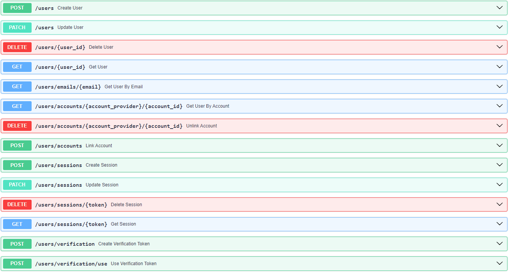

# Python adapter for Auth.js

The Python Adapter for Auth.js project migrates the PostgreSQL adapter from TypeScript to Python, enabling seamless integration of Auth.js with Python applications. It includes a REST API using SqlAclhemy, Pydantic and Redis for session storage.

### Contributing
Before you start, make sure you have Docker and Docker Compose installed on your machine.

1. Clone the repository
```bash
git clone https://github.com/mr-raccoon-97/python-adapter-for-auth.js.git
cd python-adapter-for-auth.js
```

2. Run tests with the following command:
```bash
docker-compose --profile tests up --build --exit-code-from python-tests
```

3. Run the api in development mode with the following command:
```bash
docker-compose --profile dev up --build
```

Go to `http://0.0.0.0:8000/docs` to see the Swagger documentation.



4. Add the following [adapter](rest-adapter.ts) to your Auth.js project as stated in the [documentation](https://next-auth.js.org/getting-started/introduction). (The Auth.js documentation is very obscure, so I recommend you to try other adapters first, like the pg-adapter, to setup an adapter).

```typescript
import type {
    Adapter,
    AdapterUser,
    AdapterAccount,
    VerificationToken,
    AdapterSession,
} from "@auth/core/adapters"
import axios from 'axios';

export function mapExpiresAt(account: any): any {
    const expires_at: number = parseInt(account.expires_at)
    return {
        ...account,
        expires_at,
    }
}

export type Routes = {
    createUser?: string;
    updateUser?: string;
    deleteUser?: string;
    getUser?: string;
    getUserByEmail?: string;
    getUserByAccount?: string;
    linkAccount?: string;
    unlinkAccount?: string;
    createSession?: string;
    updateSession?: string;
    deleteSession?: string;
    getSessionAndUser?: string;
    createVerificationToken?: string;
    useVerificationToken?: string;
};
  
export default function RestAdapter(
    backendUrl: string = 'http://0.0.0.0:8000',
    routes: Routes = {
        createUser: '/users',
        updateUser: '/users',
        deleteUser: '/users',
        getUser: '/users',
        getUserByEmail: '/users/emails',
        getUserByAccount: '/users/accounts',
        linkAccount: '/users/accounts',
        unlinkAccount: '/users/accounts',
        createSession: '/users/sessions',
        updateSession: '/users/sessions',
        deleteSession: '/users/sessions',
        getSessionAndUser: '/users/sessions',
        createVerificationToken: '/users/verification',
        useVerificationToken: '/users/verification/use'
    }

): Adapter {
    let client = axios.create({
        baseURL: `${backendUrl}/auth`,
        headers: {
          'Content-Type': 'application/json',
          'x-auth-secret': process.env.NEXTAUTH_SECRET
        }
    });

    return {
        createUser: async (user: Omit<AdapterUser, 'id'>) => {
            let response = await client.post(routes.createUser!, user);
            return response.data as AdapterUser;
        },
        
        updateUser: async (user: Partial<AdapterUser> & Pick<AdapterUser, 'id'>) => {
            let response = await client.patch(routes.updateUser!, user);
            return response.data as AdapterUser;
        },
    
        deleteUser: async (id: string) => {
            await client.delete(`${routes.deleteUser!}/${id}`);
        },
        
        getUser: async (id: string) => {
            let response = await client.get(`${routes.getUser!}/${id}`);
            return response.data ? response.data as AdapterUser : null;
        },
    
        getUserByEmail: async (email: string) => {
            let response = await client.get(routes.getUserByEmail!, { params: { email } });
            return response.data ? response.data as AdapterUser : null;
        },
    
        getUserByAccount: async ({providerAccountId, provider}: Pick<AdapterAccount, 'provider' | 'providerAccountId'>) => {
            let response = await client.get(`${routes.getUserByAccount!}/${provider}/${providerAccountId}`);
            return response.data ? response.data as AdapterUser: null;
        },
    
        linkAccount: async (account: AdapterAccount) => {
            let response = await client.post(routes.linkAccount!, account);
            return mapExpiresAt(response.data) as AdapterAccount;
        },
    
        unlinkAccount: async (account: Pick<AdapterAccount, 'provider' | 'providerAccountId'>) => {
            await client.delete(`${routes.unlinkAccount!}/${account.provider}/${account.providerAccountId}`);
        },
    
        createSession: async (session: { sessionToken: string; userId: string; expires: Date }) => {
            let response = await client.post(routes.createSession!, session);
            return response.data as AdapterSession;
        },
    
        updateSession: async (session: Partial<AdapterSession> & Pick<AdapterSession, 'sessionToken'>) => {
            let response = await client.patch(routes.updateSession!, session);
            return response.data as AdapterSession;
        },
    
        deleteSession: async (sessionToken: string) => {
            await client.delete(`${routes.deleteSession!}/${sessionToken}`);
        },
    
        getSessionAndUser: async (sessionToken: string | undefined) => {
            let session = await client.get(`${routes.getSessionAndUser!}/${sessionToken}`);
            if (!session.data) return null;
            let userID = session.data.userId;
            let user = await client.get(`${routes.getUser!}/${userID}`);
            if (!user.data) return null;
            return { session: session.data, user: user.data } as { session: AdapterSession, user: AdapterUser };
        },
    
        createVerificationToken: async (verificationToken: VerificationToken) => {
            let response = await client.post(routes.createVerificationToken!, verificationToken);
            return response.data as VerificationToken;
        },
    
        useVerificationToken: async ({ identifier, token }: { identifier: string; token: string }) => {
            let response = await client.post(routes.useVerificationToken!, { identifier, token });
            return response.data as VerificationToken;
        },
    }
}
```

To clean up the containers:
```bash
docker compose down -v --remove-orphans
```

### Note
The database schemas in this projects differ from the original Auth.js project, and I'm planning to change it even more, since they have a very poor design, (that's the idea of adapters, right?). For example, I used Redis for sessions and tokens storage, for better performance and automatic expiration.

I will be adding ports to make the infrastructure pluggable into the controller, so you can use the same controller with different adapters.

While the project is already tested and functional, it is still in development. You should setup the project in a production environment at your own risk. I don't make any guarantees about the project's stability, security, or performance, and I am not responsible for any damages that may occur from using this project.

### License
This project is licensed under the MIT License - see the [LICENSE](LICENSE) file for details.

### Contact
If you have any questions, feel free to contact me at curious.mr.fox.97@gmail.com. Feel free to contribute and enhance the project.